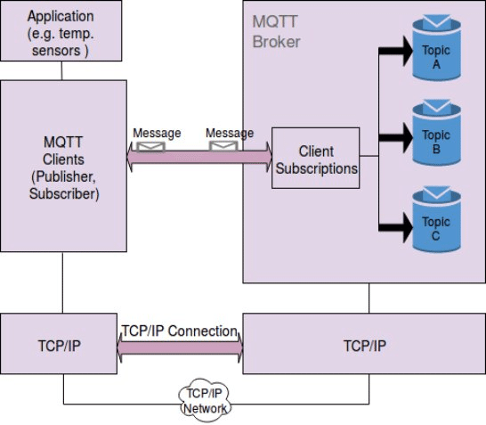

# Dpubsub

Dpubsub is a project that implements MQTT in c

# Architecture

 

# License

[MIT](./LICENSE)

# References

- [MQTT Doc](https://mqtt.org/mqtt-specification/)
- [CMake Doc](https://cmake.org/documentation/).
- Architecture image reference: [Soni, Dipa & Makwana, Ashwin. (2017). A SURVEY ON MQTT: A PROTOCOL OF INTERNET OF THINGS(IOT)](https://www.researchgate.net/publication/316018571_A_SURVEY_ON_MQTT_A_PROTOCOL_OF_INTERNET_OF_THINGSIOT)

